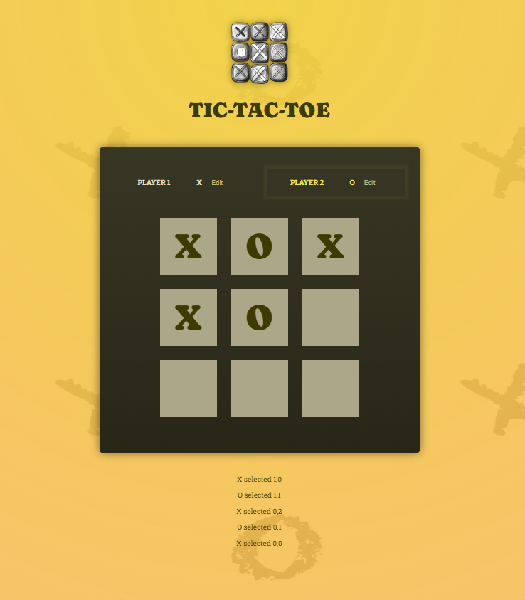

# React Tic-Tac-Toe Game

A simple Tic-Tac-Toe game built using React.js. This project demonstrates fundamental React concepts such as state management, event handling, and component-based architecture.

## Live Demo
[Play the Game](https://akashmohan0301.github.io/React-Tic_Tac_Toe_Game/)

## Features
- Interactive Tic-Tac-Toe game
- Keeps track of player turns
- Determines the winner
- Reset game functionality

## Installation

To run the project locally, follow these steps:

1. Clone the repository:
   ```sh
   git clone https://github.com/akashmohan0301/React-Tic_Tac_Toe_Game.git
   ```
2. Navigate to the project directory:
   ```sh
   cd React-Tic_Tac_Toe_Game
   ```
3. Install dependencies:
   ```sh
   npm install
   ```
4. Start the development server:
   ```sh
   npm start
   ```
5. Open [http://localhost:3000](http://localhost:3000) in your browser to play the game.

## Technologies Used
- React.js
- JavaScript (ES6+)
- CSS
- HTML

## Contributing
Feel free to fork this repository and submit pull requests for improvements.

## License
This project is licensed under the MIT License.

#Screenshot
-
